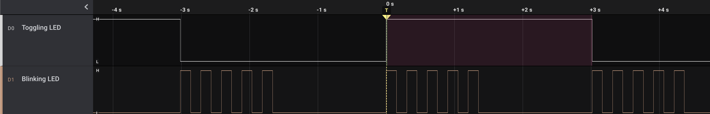
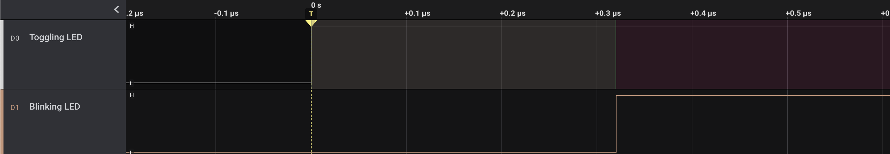
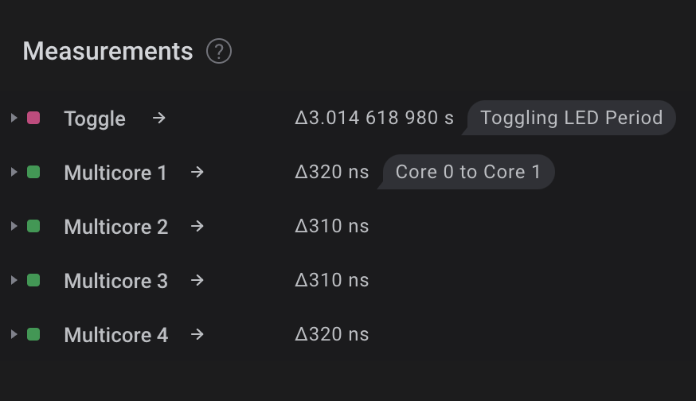

# pico_timer
Simple interrupt driven code for RP2040 for coding challenge

## Tasks
* Implement a 16-bit timer
* Toggle LED within 30ms of each time timer reaches `0xFFFF`
* At a 3s interval, using the same timer, have a separate LED blink five times

## Building & Deploying Application

### Prerequisites
* Docker
* Raspberry Pi Pico microcontroller

### Setting Up Environment
1. `./buildContainer.sh` to create local docker image to house cross-compilation tools (should only need to be called once)
2. `./launchContainer.sh` to launch an instance of the docker container (used whenever we need to compile)
3. `./prepEnvironment.sh` to clone/pull the most updated version of the C/C++ SDK for the RP2040 (generally used once)


### Build Process
Building will require Raspberry Pi Pico's SDK. The above mentioned scripts should handle the dependencies such that all one should require is Docker.

The CMake scripts to incorporate the Pico SDK will rely on an environment variable containing the path to the SDK. After running `prepEnvironment.sh` you may simply source the `sourceme` file included, and proceed to build as follows:

```sh
. ./sourceme
mkdir build
cd build
cmake ..
make -j
```

### Deploying Application

To deploy to the Raspberry Pi Pico microcontroller, hold the `BOOTSEL` button while connecting to 
a computer over USB. This will place the microcontroller into a mass-storage device mode where the 
compiled `.uf2` file can be copied over. The microcontroller should reboot and flash the application.

## Results & Findings

For my implementation, I didn't actually have any LEDs on hand let alone a microcontroller with headers soldered on. What I did have, however, was a Salae Logic Analyzer to ensure I'm driving the GPIO correctly. Fortunately the board also has one LED on board to provide a simple sanity check.

As can be seen below, the code was designed such that the blinking of the second LED should roughly coincide with the toggling of the first LED.



Though, these two separate routines cannot coincide perfectly despite being separated across the two available cores. Below we have a visual of the time difference between the two routines beginning.





### Core 0 to Core 1 Delay

My methodology of determining the time before blinking of the LEDs to trigger after the message was passed from Core 0 to Core 1 was to simultaneously asserta logic pin when toggling the first LED with each overflow of the 16bit counter. This logic pin was used as a trigger for my logic analyzer where I captured the toggling and blinking of LEDs.

As mentioned, the code was designed such that the blinking LED routine should begin as soon as possible and in a non-blocking manner. Any delay between the two LED routines coinciding perfectly would have been from the time it took to place a 32bit value on the Core 0 to Core 1 hardware FIFO, have Core 1 successfully read from the FIFO, decode the value into an address in memory, jump to that address in memory, and then finally execute that routine.

I found this to take between 310 and 320ns. The documentation for the microprocessor reveals a clock speed of 125MHz so about 40 clock cycles.Considering the documentation for the ARM Cortex M0+ says that the vast majority of the instructions take at most a handful of clock cycles, I would take a guess and say that the lion's share of the 320ns delay may have been an underlying polling method in the blocking function call to read from the hardware FIFO.

### Actual Timer/Counter Duration

The hardware timer was initialized such that it would cause an interrupt to occur every 46us. This tick frequency was selected as it would give us the closest result to 3 seconds after $2^{16}$ increments. Theoretically, at each rollover of the counter we should have seen approximately 3.014656 seconds. In the measurements figure above we can see that we are barely 37us off of our ideal. I would certainly be curious to see how this number may possibly drift with time.
